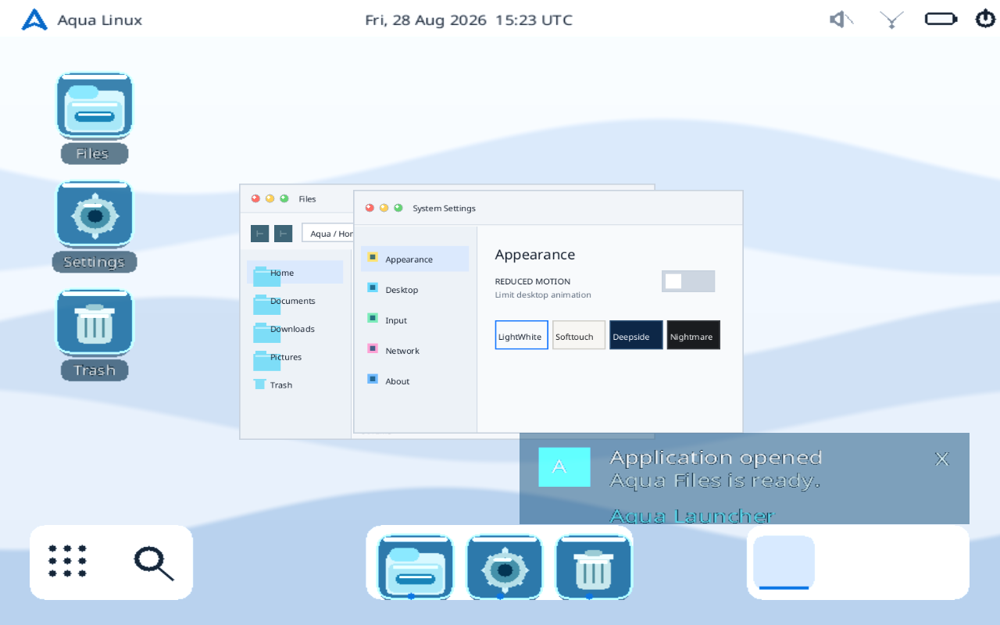

# Aqua Linux

Aqua Linux is an independent Buildroot-based Linux distribution built around
a custom Rust/Smithay Wayland compositor.

It is not an Ubuntu or Debian derivative, an existing desktop remix, or a
KDE/GNOME/XFCE/LXQt theme pack. Ubuntu appears only in
`Dockerfile.buildroot` as a reproducible Linux build host for Buildroot; it is
not part of the Aqua Linux runtime image.

> **Development status:** active prototype. The Buildroot image boots in QEMU,
> provides a recovery shell, runs the custom compositor through an explicit
> graphics gate, supports real Wayland clients and first-party prototype
> applications, and exercises a guarded graphical installer. The new visual
> direction is documented but has not yet fully converged in the runtime shell.
> Aqua Linux is not ready for installation on a daily-use machine.

## What Is Real Today

- Reproducible Buildroot x86_64 image generation.
- Linux kernel, BusyBox userspace, serial boot markers, and recovery shell.
- Custom Smithay Wayland compositor with DRM/KMS, GBM/EGL, libinput, and
  `xdg-shell` support in QEMU.
- Focus, stacking, move, resize, maximize, fullscreen, close, and client
  lifecycle handling.
- Prototype Aqua Files, Settings, Properties, Terminal, shell surfaces, and
  process supervision.
- Graphical installer state machine with target validation, explicit destructive
  confirmation, disposable-QEMU execution tests, GRUB2 UEFI installation, and
  recovery checks.
- Automated Rust, asset, renderer, session, and QEMU-oriented contract tests.

## Not Finished

- Runtime convergence with the canonical Aqua interface contract.
- Final Aqua-owned application and status icons.
- Production login/first-run experience.
- Audio, Wi-Fi, Bluetooth, battery, suspend/resume, and update UX.
- MSI Sword 17 hardware validation.
- Security hardening, accessibility completion, release engineering, and stable
  binary distribution.

The detailed roadmap is in
[milestones.md](docs/aqua-linux/milestones.md). The generated progress report
uses explicit milestone percentages and is available at
[progress.md](docs/aqua-linux/progress.md).

## Architecture

```text
Firmware / QEMU
  -> Linux kernel
  -> Buildroot userspace and BusyBox init
  -> Aqua session supervisor
  -> aqua-compositor (Smithay + DRM/KMS)
  -> aqua-shell / aqua-scene / aqua-renderer
  -> first-party Wayland clients
```

| Crate | Responsibility |
| --- | --- |
| `aqua-compositor` | Wayland protocols, DRM/KMS output, input, window lifecycle, session integration |
| `aqua-scene` | Shared scene geometry and surface contracts |
| `aqua-renderer` | Software and GLES rendering, application surface rasterization |
| `aqua-shell` | Launcher, dock, desktop, Files/Settings state, notifications, session behavior |
| `aqua-installer` | Installer model, storage validation, transaction planning and execution gates |
| `aqua-host-tools` | Bounded host-side preview and development probes |

Architecture decisions and implementation details live under
[`docs/aqua-linux/`](docs/aqua-linux/).

## Build

### Requirements

- Docker Desktop or a Linux Buildroot host.
- Rust 1.85 toolchain for local checks.
- QEMU x86_64 for booting the generated image.
- `expect`, Python 3, and `jq` for extended validation.

Recommended macOS build:

```sh
scripts/build-image-docker-volume.sh
```

Alternative Docker and Linux-host paths:

```sh
scripts/build-image-docker.sh
scripts/build-image.sh
```

Generated artifacts are written below `build/buildroot-output/images/` and are
ignored by Git.

## Run In QEMU

Boot the default recovery-safe image:

```sh
scripts/run-qemu.sh
```

Serial output is written to `build/qemu-serial.log`. A successful recovery
boot includes:

```text
[AQUA-BOOT] stage=recovery-ready status=ok shell=/bin/sh
```

The default image deliberately keeps `boot_graphics=false` and
`autostart=false`. The opt-in graphical acceptance path is:

```sh
scripts/check-graphical-boot-qemu.sh
```

For the operator-controlled visible runbook:

```sh
scripts/run-qemu-visible-manual.sh
```

These scripts use QEMU artifacts only. Installer execution tests are hard-bound
to disposable QEMU disks; do not weaken their target and confirmation gates.

## Verify

```sh
scripts/check.sh
scripts/check-public-repo.sh
```

After a successful Buildroot build:

```sh
scripts/check-image.sh
```

The QEMU checks emit serial markers and machine-readable summaries rather than
requiring trust in screenshots alone.

## Design References Versus Runtime Screenshots

Private concept boards are kept in the Git-ignored
`docs/aqua-linux/local-references/` workspace. They are design inputs, not
screenshots of the current operating system, and are never committed or
packaged into the root filesystem. The public repository contains the derived
layout, behavior, token, and component contracts instead.

Current OS screenshots must be labeled as QEMU captures and generated through
the QEMU validation/capture scripts. Third-party icons visible in concept boards
must not be extracted into Aqua Linux.

### Current QEMU Runtime



The [runtime screenshot set](docs/aqua-linux/runtime-screenshots.md) contains
the clean desktop, Applications, Global Search, and first-party windows. Each
committed PNG is tied to a successful QEMU marker and SHA-256 manifest.

See [visual-reference.md](docs/aqua-linux/visual-reference.md) and
[ASSET_LICENSE.md](ASSET_LICENSE.md).

## Project Status And Claims

- Completed means the documented milestone's tested engineering contract is
  complete; it does not mean the whole v1 product is complete.
- The public overall percentage is the rounded arithmetic mean of the twelve
  milestone percentages in `progress.json`.
- Host-side mockups and website work do not count as OS completion.
- Hardware support is not claimed until it is validated on the named hardware.
- Release images are not offered until Buildroot legal information and
  corresponding-source obligations are reviewed.

## Contributing

Read [CONTRIBUTING.md](CONTRIBUTING.md) before opening a pull request. Small,
testable changes that preserve the Buildroot base, recovery path, and custom
compositor architecture are preferred.

Security issues should follow [SECURITY.md](SECURITY.md), not public issue
threads.

## Licensing

Aqua Linux source code is available under the [MIT License](LICENSE).

Logos, wallpapers, screenshots, and promotional artwork are not
automatically covered by MIT. See [ASSET_LICENSE.md](ASSET_LICENSE.md).
Third-party notices are listed in
[THIRD_PARTY_LICENSES.md](THIRD_PARTY_LICENSES.md), and the current audit is in
[license-audit.md](docs/aqua-linux/license-audit.md).
