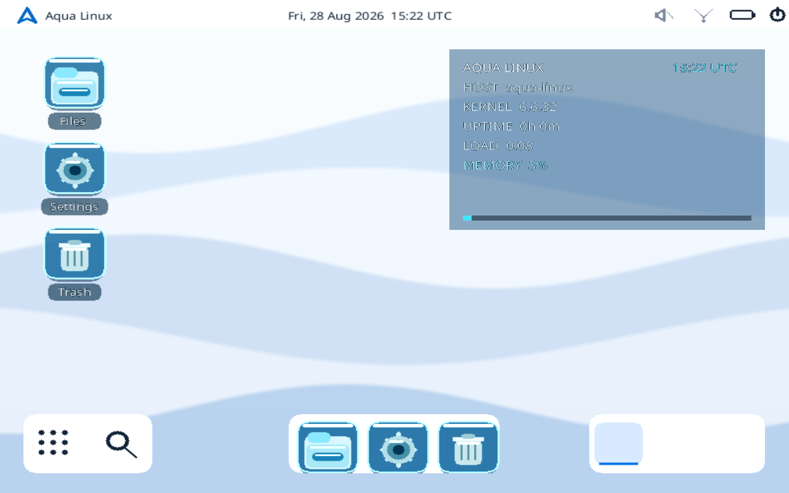
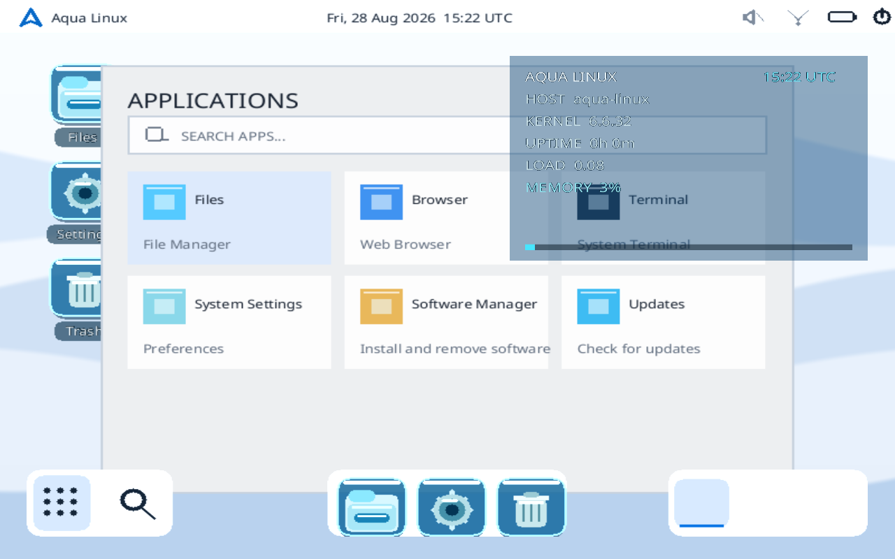
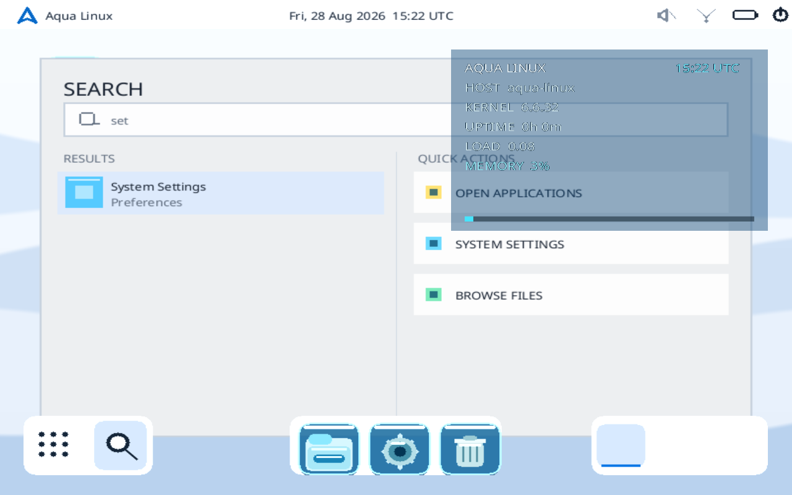

# Aqua Linux Runtime Screenshots

These images are captures of the current Aqua Linux runtime in QEMU x86_64
TCG. They are not design references, browser mockups, or claims about hardware
support. The capture path boots the Buildroot image, starts the custom Smithay
Wayland compositor through the explicit graphics gate, exercises real shell
input and first-party Wayland clients, then requires a clean session stop.

Regenerate and publish the set with:

```sh
scripts/check-public-runtime-qemu.sh
scripts/publish-public-runtime-screenshots.sh
```

The committed [manifest](assets/runtime/manifest.json) records the source
revision, QEMU environment, dimensions, validation marker, and SHA-256 digest
for each image.

## Clean Desktop



## Applications



## Global Search



## First-Party Windows


